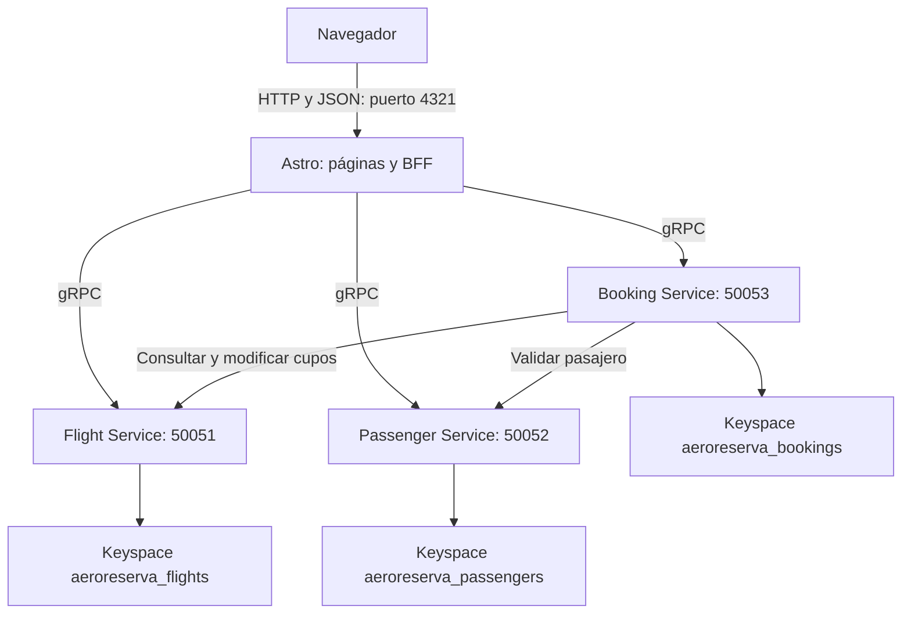

# Guía de AeroReserva: código, patrones y ejecución

## 1. Qué hace el proyecto

AeroReserva permite consultar vuelos, identificarse con documento y correo, crear una reserva, ver las reservas propias y cancelarlas. El navegador trabaja con números de vuelo y códigos de reserva; los UUID se usan internamente.

La identificación es de demostración: conocer documento y correo permite ingresar. No equivale a autenticación productiva.

## 2. Stack tecnológico

| Capa | Tecnología del repositorio | Responsabilidad |
| --- | --- | --- |
| Interfaz y BFF | Astro 7, TypeScript y adaptador Node | Renderizar páginas, recibir HTTP/JSON, comprobar sesión y llamar a gRPC |
| Runtime web en Docker | Node.js 24 | Ejecutar el servidor generado por Astro |
| Servicios | Ruby 4 y Rails 8.1 en modo API | Entorno de cada servicio y lógica del negocio |
| Comunicación interna | gRPC 1.84 en Ruby, grpc-js en Node, Protocol Buffers | Llamadas entre procesos con mensajes definidos en un contrato |
| Persistencia | Cassandra 4.0 y cassandra-driver Ruby 3.2 | Consultas por clave, tablas por consulta, LWT para cambios condicionales |
| Ejecución | Docker y Docker Compose | Construir imágenes, crear red, configurar dependencias y conservar datos |
| Pruebas | Minitest y Playwright con Edge | Comportamiento Ruby, integración real y flujo de navegador |

Aunque los servicios tienen estructura Rails, su proceso principal es `bundle exec ruby bin/grpc_server`, no `rails server`. La lógica principal está en `lib/`. Cassandra se usa mediante su driver Ruby; Active Record está deshabilitado.

## 3. Arquitectura



Los tres keyspaces viven en la misma instancia Cassandra de la demo. La separación de datos es lógica: cada servicio abre su keyspace y no consulta tablas de otro servicio.

El BFF, o *Backend for Frontend*, es la parte de Astro que corre en el servidor. Adapta la interfaz HTTP que necesita el navegador a las llamadas gRPC de los microservicios. Por ejemplo, reúne una reserva con los detalles de su vuelo antes de enviarla a Mis reservas.

## 4. Organización del código

```text
frontend/
  src/pages/
    index.astro              Catálogo, filtros y selección de vuelo
    ingresar.astro           Ingresar o registrar perfil
    reservar.astro           Confirmar el vuelo elegido
    reservas.astro           Mis reservas y cancelación
    pasajeros.astro          Redirección al ingreso
    api/flights.ts           HTTP -> Flight Service
    api/passengers.ts        Identificación, cookie y Passenger Service
    api/bookings.ts          Reservas de la sesión y Booking Service
  src/lib/
    server.ts                Clientes gRPC, cookie firmada y errores HTTP
    browser.ts               Fetch, formato de fechas y escape de texto
  src/components/GlobalNav.astro
  src/layouts/DemoLayout.astro
  Dockerfile
services/
  flight-service/
    lib/flight_service_impl.rb
    lib/cassandra_client.rb
    bin/grpc_server
    test/atomic_seats_integration_test.rb
  passenger-service/
    lib/passenger_service_impl.rb
    lib/cassandra_client.rb
    bin/grpc_server
  booking-service/
    lib/booking_service_impl.rb  Orquestación y compensación
    lib/booking_repository.rb    Persistencia de reservas
    lib/flight_client.rb         Cliente de Flight
    lib/passenger_client.rb      Cliente de Passenger
    lib/grpc_resilience.rb       Circuit Breaker, deadline y retry
    lib/cassandra_client.rb
    bin/grpc_server
    test/
  Dockerfile                 Imagen común, seleccionada mediante SERVICE
proto/aeroreserva.proto       Contrato compartido
infrastructure/cassandra/
  01-schema.cql              Keyspaces y tablas
  02-seed-flights.cql         Nueve vuelos de ejemplo
tests/
  demo-flow.cjs               Prueba completa de navegador
  catalog_consistency.rb     Consistencia de las tablas de vuelos
docker-compose.yml           Servicios, red, puertos y volumen
.env.example                 Valores de desarrollo para resiliencia
```

### Contrato gRPC

`proto/aeroreserva.proto` contiene el paquete `aeroreserva.v1`, mensajes como `Flight`, `Passenger` y `Booking`, y los RPC de cada servicio:

- Flight: `ListFlights`, `GetFlight`, `CheckAvailability`, `OccupySeat`, `ReleaseSeat`.
- Passenger: `FindPassenger`, `CreatePassenger`, `GetPassenger`.
- Booking: `ListBookingsByPassenger`, `CreateBooking`, `GetBooking`, `ListBookings`, `CancelBooking`.

Ruby usa los archivos generados `aeroreserva_pb.rb` y `aeroreserva_services_pb.rb` de cada servicio. Astro carga el mismo `.proto` mediante `@grpc/proto-loader`. Para este bloque de resiliencia no hizo falta cambiar el contrato.

## 5. Cómo se procesa una reserva

1. Inicio consulta `GET /api/flights` y muestra tarjetas.
2. Seleccionar lleva a `/reservar?vuelo=AR404`, por ejemplo.
3. Si no existe sesión, se redirige a Ingresar, conservando el vuelo.
4. Astro identifica o registra al pasajero mediante Passenger Service y firma una cookie de ocho horas.
5. Confirmar envía `POST /api/bookings`. El pasajero se obtiene de la cookie del servidor.
6. Booking valida al pasajero y el vuelo por gRPC, ocupa un cupo y persiste la reserva.
7. El navegador recibe el código de reserva. Mis reservas reúne sus datos con los del vuelo.
8. Cancelar envía el código a `DELETE /api/bookings`. El BFF comprueba que pertenece al pasajero antes de llamar a `CancelBooking`.

## 6. Patrones implementados

### Circuit Breaker

`grpc_resilience.rb` mantiene un circuito para Flight y otro para Passenger dentro del proceso Booking:

- **Cerrado:** permite llamadas y cuenta fallos transitorios consecutivos.
- **Abierto:** rechaza inmediatamente sin enviar una nueva llamada gRPC.
- **Medio-abierto:** después del tiempo de recuperación permite una sola llamada de prueba. Si responde, cierra el circuito; si vuelve a fallar, lo abre otra vez.

Un mutex protege los estados frente a los hilos del servidor. Los logs JSON usan `pattern: circuit_breaker` y eventos `opened`, `rejected`, `half_open_probe` y `recovered`.

### Timeout y retry

Cada llamada saliente de Booking lleva un deadline. Solo `GetFlight` y `GetPassenger` pueden repetirse ante `Unavailable` o `DeadlineExceeded`, con un límite configurable. `OccupySeat` y `ReleaseSeat` se envían una sola vez: repetir una escritura tras un timeout podría alterar cupos dos veces.

El timeout limita la espera del cliente; no demuestra que el servidor no haya ejecutado la escritura.

### Saga orquestada

Booking coordina los pasos:

```text
Validar pasajero -> validar vuelo -> ocupar cupo -> persistir reserva
                                           |
                        falla persistencia o respuesta posterior
                                           |
                     marcar intento CANCELLED -> liberar cupo
```

La compensación intenta dejar el intento cancelado y devolver el cupo. Sus resultados aparecen en logs `pattern: booking_saga`. La reserva solo se devuelve confirmada después de que la persistencia haya respondido correctamente.

Esto no es una transacción distribuida ACID: un corte de proceso o un fallo de la compensación puede necesitar reconciliación manual.

### Cupos atómicos con LWT

`flights_by_id` es la fuente de verdad. Flight calcula el nuevo valor y ejecuta una actualización condicional:

```sql
UPDATE flights_by_id
SET available_seats = ?
WHERE id = ?
IF available_seats = ?;
```

Si dos solicitudes leen 1 cupo, solo una logra cambiarlo a 0. La otra recibe `[applied] = false`, vuelve a consultar y detecta que no quedan cupos. Solo se repiten conflictos confirmados; un timeout no se reintenta automáticamente.

La liberación usa la misma técnica y no permite superar `total_capacity`.

### Tablas por consulta y proyecciones

Cassandra utiliza tablas como `bookings_by_id` y `bookings_by_passenger` para responder directamente por sus claves. Booking escribe sus representaciones mediante un batch registrado en la creación y la compensación. Un batch no aporta aislamiento de lectura entre particiones.

`flights_catalog` es una proyección. Sus cupos se actualizan con `WRITETIME(available_seats)` de la fuente: una escritura retrasada conserva su timestamp antiguo y no pisa una nueva. `ListFlights` consulta los valores autoritativos en grupos y repara la proyección. Puede haber una ventana de consistencia eventual entre tablas.

La versión actual también usa LWT para reclamar la cancelación de una reserva y para evitar registrar simultáneamente el mismo documento. Los límites ante timeouts ambiguos están en el informe de resiliencia.

## 7. Cómo levantarlo en otra máquina

### Opción A: ejecutar una copia completa del sistema

Requisitos: Git y Docker con Compose v2, Docker iniciado y soporte para contenedores Linux. Para ejecutar todo con Docker no necesitas instalar Node, Ruby, Rails ni Cassandra en el equipo anfitrión.

```sh
git clone https://github.com/sara-munoz-5/taller-microservicios.git
cd taller-microservicios
docker compose up --build -d
docker compose ps
```

Si el repositorio requiere permisos, usa una cuenta autorizada. El clon obtiene lo publicado en GitHub: para reproducir cambios locales aún no publicados, copia también esos archivos. Esta guía no realiza commit ni push.

Abre **http://127.0.0.1:4321**. Compose hace lo siguiente:

1. Inicia Cassandra y espera su healthcheck.
2. `cassandra-init` aplica esquema y seed. Es normal que termine en `Exited (0)`.
3. Inicia Passenger y Flight; después Booking.
4. Inicia el servidor Astro.

Las primeras compilaciones necesitan Internet para descargar imágenes, gems y paquetes npm. Los puertos 4321, 9042 y 50061 deben estar libres según el Compose actual.

Para cambiar parámetros, copia `.env.example` a `.env` en la raíz (`Copy-Item .env.example .env` en PowerShell, o `cp .env.example .env` en una shell Unix), edítalo y vuelve a ejecutar `docker compose up --build -d`.

### Opción B: abrir desde otro computador la instancia que ya está corriendo

En la misma red, entra a:

```text
http://IP_DEL_COMPUTADOR_QUE_EJECUTA_DOCKER:4321
```

En Windows puedes consultar esa IP con `ipconfig`. El puerto TCP 4321 debe ser accesible según el firewall de esa máquina. En el otro equipo no uses `localhost`: ese nombre apunta al propio equipo donde está abierto el navegador.

No hay que sustituir `flight-service`, `passenger-service`, `booking-service` ni `cassandra` por IP en el código. Esos nombres se resuelven dentro de la red de Compose. Abrir la web por LAN no implica desplegar cada microservicio en un computador diferente.

### Puertos reales

| Componente | Dentro de Docker | Publicado en el anfitrión |
| --- | --- | --- |
| Astro | 4321 | 4321 |
| Flight | 50051 | 50061 |
| Passenger | 50052 | No publicado |
| Booking | 50053 | No publicado |
| Cassandra | 9042 | 9042 |

### Datos y sesiones

El volumen `aeroreserva_cassandra_4_data` conserva los datos en esa máquina. Clonar el repositorio no copia pasajeros ni reservas de otra instalación: la nueva máquina crea su propio volumen y carga el seed. Para mover datos existentes haría falta un procedimiento de respaldo/restauración aparte.

El seed usa `IF NOT EXISTS`; repetir el arranque conserva los cupos existentes. Sus fechas son de octubre de 2026 y deben revisarse para demostraciones posteriores.

La firma de sesión usa una clave aleatoria por proceso: reiniciar el frontend obliga a ingresar otra vez. La demo no debe exponerse como un sistema de autenticación productivo.

## 8. Operación y pruebas

```sh
# Estado, incluido el inicializador que ya terminó
docker compose ps -a

# Logs de resiliencia
docker compose logs --tail 100 booking-service flight-service

# Detener sin borrar datos
docker compose stop

# Reanudar
docker compose start

# Reconstruir después de cambiar código
docker compose up --build -d
```

Para el build fuera de Docker necesitas Node compatible con `frontend/package.json`:

```sh
npm --prefix frontend ci
npm --prefix frontend run build
```

Las pruebas y sus resultados, comandos exactos y limitaciones están en [validacion-resiliencia.md](validacion-resiliencia.md). El flujo de navegador está en `tests/demo-flow.cjs`.
